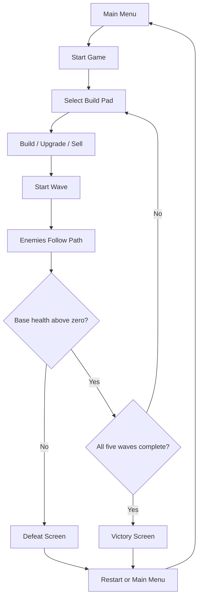
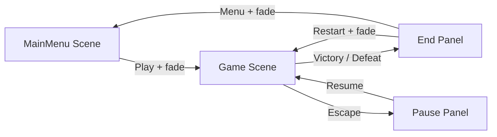

# Simple Tower Defense — Game Design Document

## Document information

- Student: `[Student name]`
- Course: `[Course name]`
- Instructor: `[Instructor name]`
- Academic year: `[Academic year]`
- Engine: Unity 6.3 (`6000.3.22f1`)
- Target platform: Windows desktop

## Game concept

Simple Tower Defense is a short desktop strategy game in which the player protects a base from five
increasingly difficult enemy waves. Enemies follow a fixed road. The player spends credits on three
different tower types, then upgrades or sells those towers to respond to faster and tougher enemies.

The project is intentionally limited to one readable level. Its purpose is to demonstrate a complete
game loop, understandable C# architecture, progression, user interface, persistence, sound and visual
feedback without hiding the mechanics behind a large framework.

## Target audience

The game is aimed at casual strategy players and students learning the tower-defense genre. A typical
session takes approximately 8–12 minutes. The controls require only a mouse, keyboard movement keys and
the Escape key, so prior experience with complex strategy games is not required.

## Player experience goals

- Understand the objective within the first minute.
- Make meaningful choices between attack speed, direct damage and splash damage.
- See and hear immediate feedback for building, attacking and destroying enemies.
- Experience clear difficulty progression across five waves.
- Complete a full menu → gameplay → victory/defeat → restart loop.

## Artistic concept

The visual direction combines a dark blue battlefield with bright, readable interaction colors.
Build pads use blue to communicate valid construction locations. The project-specific enemy and tower
prefabs use licensed third-party science-fiction mesh files listed in `ASSET_ATTRIBUTION.md`. The level
composition, materials and interface were created for this project. The interface uses simple rectangular
panels, white text and cyan highlights so gameplay information remains readable above the 3D scene.

Particle colors communicate events:

- Yellow: bullet impact
- Orange: rocket explosion
- Red: enemy destruction
- Cyan: tower construction

Menu and gameplay music use separate tracks. Short sound effects distinguish the three tower weapons
and confirm important actions such as building, upgrading, selling, taking base damage, victory and
defeat.

## Core mechanics

### Player controller interpretation

Tower defense does not use a walking player avatar. The player's controlled object is therefore the
camera, combined with mouse-based build selection. WASD or arrow keys move the view smoothly, the mouse
wheel zooms it, and movement limits prevent the player from losing the level. A mouse raycast selects a
build pad or an existing tower. This is the genre-specific equivalent of a traditional Player
Controller.

### Building and economy

The player starts with 400 credits and 20 base health. Clicking one of seven fixed build pads opens the
tower purchase panel. Destroying enemies awards both credits and score. A built tower can be upgraded
once or sold for a partial refund.

### Combat

Towers periodically search for the nearest enemy inside their range and rotate toward it. Machine Gun
and Rocket towers launch homing projectiles. A continuous sphere cast helps projectiles register contact
between frames. Rockets use a physics overlap sphere to damage multiple enemies. The Laser tower applies
direct damage and briefly displays a beam.

### HUD resource interpretation

The assessment rubric mentions ammunition, but ammunition is not a resource in this tower-defense
design. The HUD instead displays the four resources that directly affect decisions:

- Base health
- Credits
- Score
- Current wave and enemies remaining

## Controls

| Input | Action |
| --- | --- |
| WASD / Arrow keys | Move camera |
| Mouse wheel | Zoom camera |
| Left mouse button | Select build pad or tower; press UI buttons |
| Escape | Pause or resume gameplay |

## Tower balance

| Tower | Cost | Range | Damage | Attacks/sec | Special | Upgrade cost | Sell value |
| --- | ---: | ---: | ---: | ---: | --- | ---: | ---: |
| Machine Gun | 100 | 7.5 | 9 | 3.5 | Fast single-target bullets | 90 | 65 |
| Laser | 140 | 8.5 | 25 | 0.8 | Immediate beam damage | 120 | 90 |
| Rocket | 180 | 9.5 | 30 | 0.65 | 2.3-unit splash radius | 150 | 115 |

An upgrade increases damage by 60%, range by 15% and attack speed by 20%. The Machine Gun is affordable
and consistent, the Laser delivers accurate burst damage, and the Rocket is expensive but effective
against grouped enemies.

## Enemy balance

| Enemy | Health | Speed | Credit reward | Score reward | Base damage |
| --- | ---: | ---: | ---: | ---: | ---: |
| Basic | 45 | 3.2 | 22 | 220 | 1 |
| Fast | 30 | 4.7 | 25 | 250 | 1 |
| Tank | 120 | 2.1 | 45 | 450 | 2 |

The Tank model is visually larger and uses a longer spawn interval so consecutive tanks do not overlap.

## Wave progression

| Wave | Composition | Design purpose |
| --- | --- | --- |
| 1 — Getting Started | 6 Basic | Introduce building and combat |
| 2 — Faster | 8 Basic, 2 Fast | Introduce speed pressure |
| 3 — Heavy Units | 6 Fast, 3 Tank | Introduce high-health enemies |
| 4 — Mixed Attack | 7 Basic, 4 Fast, 3 Tank | Test mixed tower coverage |
| 5 — Final Wave | 9 Basic, 7 Fast, 4 Tank | Final economy and damage check |

The player chooses when to start each wave, creating a short planning period between attacks.

## Scoring and saved progression

Each defeated enemy awards ten times its credit reward as score. The JSON save file stores:

- High score
- Highest wave reached
- Games won
- Games played
- Music volume
- SFX volume

The main menu shows the saved high score and highest wave. The settings screen allows the player to
change volume or reset progress after a confirmation.

## Game loop diagram

## Scene flow diagram

## Win and lose conditions

- Victory: all enemies in all five waves are defeated or reach the base while at least one base-health
  point remains.
- Defeat: base health reaches zero.
- Both results display the current score and saved high score, then offer restart and menu actions.

## Scope and constraints

The game contains one level, three towers, three enemies and one upgrade level per tower. It deliberately
does not include free-form tower placement, multiple campaigns, skill trees, multiplayer, inventory or
procedural levels. This keeps the project appropriate for an intermediate tutorial while still meeting
the requirements for mechanics, progression, UI, persistence and polish.
